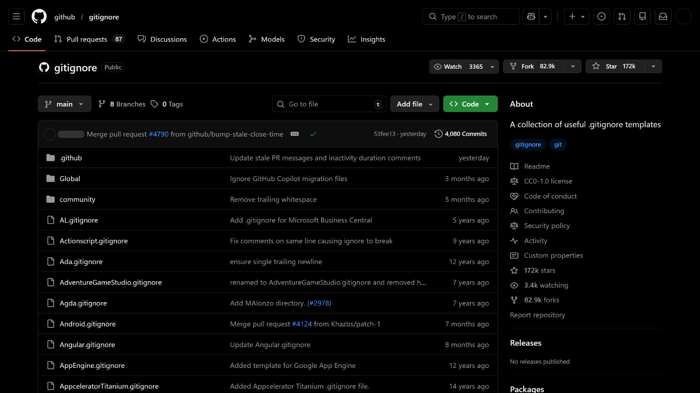

# GitHub Pitch Black Theme (Native)


A zero-latency, high-performance **Pitch Black** theme for GitHub.

Unlike standard themes that rely on heavy style managers (like Stylus) or JavaScript injection, this is a **Native Local Extension**. It utilizes the browser's raw rendering engine to inject CSS at `document_start`, ensuring **0ms latency**, **0% CPU overhead**, and absolutely **no flash of unstyled content**.



## 🚀 Features

- **True Pitch Black:** Replaces GitHub's default dark blue/gray tint (`#0d1117`) with pure `#000000`.
- **Neutral Palette:** Desaturates borders, buttons, and text to neutral grays for a clean, distraction-free look.
- **High Contrast UI:** Slightly lighter backgrounds (`#161616`) for inputs, dropdowns, and buttons to maintain visual hierarchy without breaking the void.
- **Zero Latency:** Injected via the Chrome `content_scripts` API before the DOM is painted.
- **Privacy First:** No JavaScript execution, no analytics, and no background processes.

## 🛠 Installation

Choose the method that works best for you.

### Option 1: Chrome Web Store (Recommended)

The easiest way to install and get automatic updates.

**[🔗 Add to Chrome](https://chromewebstore.google.com/detail/oipinkhefglinifinekdbanfmblfniao)** _(Link coming soon)_

### Option 2: Manual Installation (Unpacked)

Best for developers who want maximum performance or wish to customize the CSS.

1. **Download the Source:**

- Clone this repository:

```bash
git clone https://github.com/ztrahmet/github-theme-pitch-black.git
```

2. **Load into Browser:**

- Open your browser's extension manager:
  - **Chrome/Brave/Vivaldi:** `chrome://extensions`
  - **Edge:** `edge://extensions`
  - **Opera:** `opera://extensions`

- Enable **Developer mode** (toggle usually located in the top-right corner).
- Click the **Load unpacked** button.
- Select the folder containing `manifest.json` and `theme.css`.

**That's it!** GitHub is now Pitch Black.

## ⚙️ Customization

If you installed using **Option 2 (Unpacked)**, you have full control over the styling without a build process.

1. Open `theme.css` in any text editor (VS Code, Notepad, etc.).
2. Find the variable you want to change (e.g., `--fgColor-default` for text color).
3. Save the file.
4. Go back to your browser's extension page (`chrome://extensions`).
5. Click the **Reload** (circular arrow) icon on the GitHub Pitch Black Theme card.
6. Refresh GitHub to see changes instantly.

## 🧩 Compatibility

- **Fully Supported:** Google Chrome, Microsoft Edge, Brave, Opera, Vivaldi, Arc.
- **Firefox:** While the extension manifest is optimized for Chromium, Firefox users can achieve the same result by copying the contents of `theme.css` into their `userContent.css` file.

## 🤝 Contributing

Found a UI element that is still blue or lacks contrast? Contributions are welcome!

1. Fork the Project
2. Create your Feature Branch (`git checkout -b feature/FixButtonColor`)
3. Commit your Changes (`git commit -m 'Fix blue tint on submit button'`)
4. Push to the Branch (`git push origin feature/FixButtonColor`)
5. Open a Pull Request

## 📄 License

Distributed under the MIT License. See `LICENSE` for more information.
