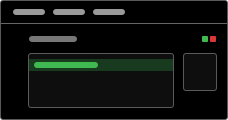

# GitHub Pitch Black Theme

[](https://github.com/ztrahmet/github-theme-pitch-black)
[](https://chromewebstore.google.com/detail/oipinkhefglinifinekdbanfmblfniao)
[](https://addons.mozilla.org/en-US/firefox/addon/github-theme-pitch-black/)
[](#build-from-source)

A zero-latency, native **Pitch Black** theme for GitHub.

Unlike style managers or JavaScript-based themes, this is a native browser extension: pure CSS, injected at `document_start`. No flash of unstyled content, no runtime overhead, no JavaScript execution at all.

<p align="center">
  
</p>

## Features

- **True Pitch Black** — replaces GitHub's default dark tint (`#0d1117`) with pure `#000000`
- **Neutral Palette** — desaturated borders, buttons, and text for a clean, distraction-free look
- **High Contrast UI** — lighter surfaces (`#161616`) for inputs, dropdowns, and buttons to preserve visual hierarchy
- **Zero Latency** — pure CSS content script, applied before first paint
- **Privacy First** — no JavaScript, no analytics, no network calls, no background processes
- **51 Languages** — the listing and extension manager entry are localized; the theme itself works in any GitHub UI language

## Install

| Browser | Source |
|---|---|
| Chrome, Edge, Brave, Opera, Vivaldi, Arc | [Chrome Web Store](https://chromewebstore.google.com/detail/oipinkhefglinifinekdbanfmblfniao) |
| Firefox | [Firefox Add-ons](https://addons.mozilla.org/firefox/addon/github-theme-pitch-black/) |
| Safari | [Build from source](#build-from-source) — not yet on the App Store |

### Build from source

```bash
git clone https://github.com/ztrahmet/github-theme-pitch-black.git
cd github-theme-pitch-black
npm run build:chrome   # or build:firefox / build:safari / build:all
```

Each target is built independently from the same `src/` files into `dist/<browser>/`. Load it unpacked:

| Browser | Steps |
|---|---|
| Chrome / Edge / Brave / Opera / Vivaldi / Arc | `chrome://extensions` → enable **Developer mode** → **Load unpacked** → select `dist/chrome` |
| Firefox | `about:debugging#/runtime/this-firefox` → **Load Temporary Add-on** → select `dist/firefox/manifest.json` |
| Safari | requires macOS + Xcode: `xcrun safari-web-extension-converter dist/safari`, then build/run the generated project from Xcode |

## Customization

1. Edit `src/css/theme.css`, the single source file shared by every browser build.
2. Run `npm install` once, then re-run the relevant `npm run build:*` command.
3. Reload the extension from your browser's extension page and refresh GitHub.

## Development

### Project structure

```
src/css/theme.css           single source of truth for the theme
src/icons/icon.svg          icon artwork; everything else here is generated
src/_locales/<locale>/      extension name and description, 51 locales
scripts/icons.mjs           regenerates the icon set from icon.svg
platforms/<browser>/        per-browser manifest.json (chrome, firefox, safari)
scripts/build.mjs           assembles dist/<browser> from src/ + platforms/<browser>
preview.svg                 README preview, drawn from the palette
store-assets/               screenshots and store listing assets
dist/                       build output (gitignored)
```

### Commands

| Command | Output |
|---|---|
| `npm run build:chrome` / `build:firefox` / `build:safari` / `build:all` | Unpacked build in `dist/<browser>/`, for local testing |
| `npm run package:chrome` / `package:firefox` / `package:all` | Zipped store package in `dist/artifacts/<browser>/*.zip` |
| `npm run lint:firefox` | Runs `web-ext lint` against the Firefox build (AMO validation) |
| `npm run icons` | Regenerates `src/icons/*` from `icon.svg`; run after changing the artwork |

Safari has no `package:safari` script — the Mac App Store requires a signed, notarized Xcode archive rather than a `.zip`, so packaging there is the `xcrun` step above followed by a submission through Xcode/App Store Connect.

### Translations

The theme itself is language-agnostic: every selector keys off structural attributes and Primer class names, never off visible text, so GitHub's UI language has no effect on it. What is translated is how the extension presents itself — its name and description in the browser's extension manager and in store search.

Each locale is one file, `src/_locales/<locale>/messages.json`, holding a single `extDescription` key. `_locales/en` additionally defines `extName`; every other locale falls back to it, so localizing the name later means adding a key, not touching a manifest.

The locale set is Chrome's supported list, which `scripts/build.mjs` enforces — Chrome rejects codes outside it at upload, while Firefox and Safari accept everything in it, so one list serves all three. The build also checks that no locale invents a key the default locale lacks, and that no string exceeds Chrome's field limits (132 characters for the description, which several translations approach).

**Corrections are welcome and are the easiest way to contribute.** The translations were machine-generated and reviewed for length and script conventions, not by native speakers. If a string reads awkwardly in your language, editing that one file is a complete pull request.

On Safari, `_locales` covers the extension, but the containing app's display name is a separate Xcode-side localization (`InfoPlist.strings` / `CFBundleDisplayName`) handled during the `xcrun` step above.

## Contributing

Found a UI element that's still blue or lacks contrast? Spotted an awkward translation in [your language](#translations)? Contributions are welcome.

1. Fork the project
2. Create a feature branch (`git checkout -b feature/fix-button-color`)
3. Commit your changes
4. Push to the branch
5. Open a pull request

## License

Distributed under the MIT License. See `LICENSE` for details.
